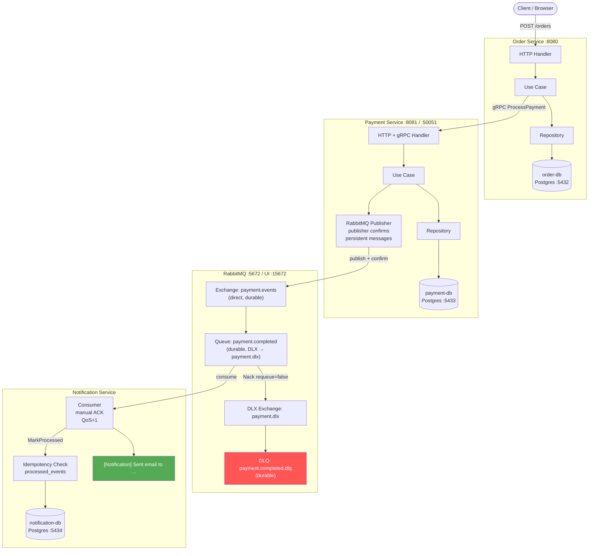

# Assignment 3 — Event-Driven Architecture Diagram

```mermaid
flowchart TD
    Client([Client / Browser])

    subgraph OrderSvc["Order Service :8080"]
        OH[HTTP Handler]
        OUC[Use Case]
        OR[Repository]
        ODB[(order-db\nPostgres :5432)]
    end

    subgraph PaymentSvc["Payment Service :8081 / :50051"]
        PH[HTTP + gRPC Handler]
        PUC[Use Case]
        PR[Repository]
        PDB[(payment-db\nPostgres :5433)]
        PUB[RabbitMQ Publisher\npublisher confirms\npersistent messages]
    end

    subgraph MQ["RabbitMQ :5672 / UI :15672"]
        EX["Exchange: payment.events\n(direct, durable)"]
        Q["Queue: payment.completed\n(durable, DLX → payment.dlx)"]
        DLX["DLX Exchange: payment.dlx"]
        DLQ["DLQ: payment.completed.dlq\n(durable)"]
    end

    subgraph NotifSvc["Notification Service"]
        CON[Consumer\nmanual ACK\nQoS=1]
        NREP[Idempotency Check\nprocessed_events]
        NDB[(notification-db\nPostgres :5434)]
        EMAIL["[Notification] Sent email to …"]
    end

    Client -->|POST /orders| OH
    OH --> OUC
    OUC --> OR --> ODB
    OUC -->|gRPC ProcessPayment| PH
    PH --> PUC
    PUC --> PR --> PDB
    PUC --> PUB
    PUB -->|publish + confirm| EX
    EX --> Q
    Q -->|consume| CON
    CON -->|MarkProcessed| NREP --> NDB
    CON --> EMAIL
    Q -->|Nack requeue=false| DLX --> DLQ

    style DLQ fill:#f55,color:#fff
    style EMAIL fill:#5a5,color:#fff
```
